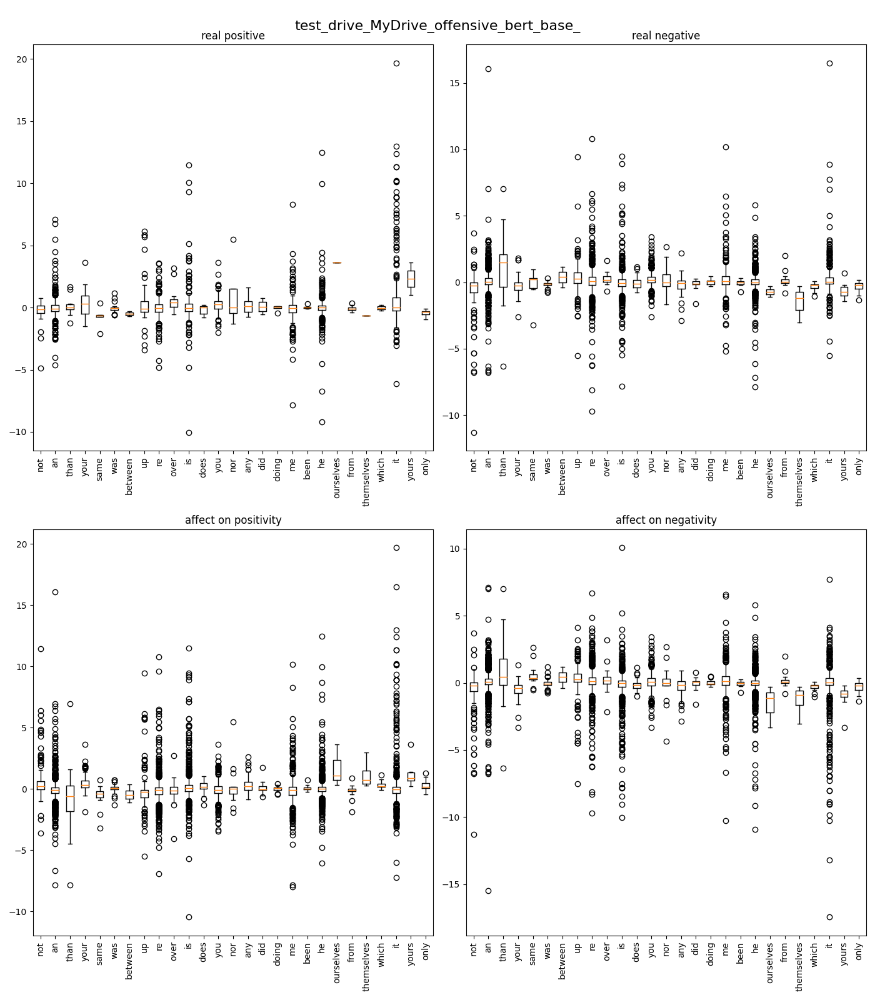

# OffensiveSpeechDetectionWithGNNs

Codes and results of 2023 summer internship

# OLID

Offensive Language Identification Dataset (OLID) dataset is a hierarchical dataset to identify the type and the target of offensive texts in social media. The dataset is collected on Twitter and publicly available.

In addition to the original dataset, we generated three extension of it named OLIDv0, OLIDv1, OLIDv2.

- OLIDv0: user tags, hashtags, urls, and emojis removed
- OLIDv1: user tags, hashtags, and urls removed, emojis replaced with relevant describing text version
- OLIDv2: user tags, urls, and emojis removed, hashtags preserved

# Model Evaluation

Our work was based on Graph Neural Networks (GNNs). We report a summary of our results on our mentioned dataset, OLID.
Also, we changed this projects interface to work better with `google colab`.

## SHINE

The source had some bugs which we fixed them.

|SHINE's Congif| OLID-raw|
|--|--|
|Defailt|66%|

## DADGNN

We also modify this project to work with more embeddings.

|DADGNN's Congif| OLIDv0| OLIDv1| OLIDv2|
|--|--|--|--|
|Default with Glove embedding| 76.56% | 76.09% | 77.27% |
|Default with Fasttext embedding| 74.92% | -- | -- |

## VGCN-BERT

Named VGB-Classifier. Use generated graph  globally for language then feed it to BERT models.

|Models's Congif| OLIDv0| OLIDv1| OLIDv2|
|--|--|--|--|
|Default|77.9%|77.11%|--|
|Using larger_cw|--|79.31%|--|
|Preserve SWs, larger_cw|78.63%|79.83%|79.46%|
|Larger_cw, dim=32|--|78.32%|--|
|reserve SWs, larger_cw, dim=32|--|78.85%|--|
|reserve SWs, larger_cw, bert_large|--|80%|--|
|Using larger_cw, all_tfidf|--|79.68%|--|
|Using larger_cw, all_tfidf, tf|--|79.61%|--|
|Using larger_cw, all_tfidf, all|--|79.15%|--|

# Stop Words

Usually, out score would decreased when we removed stopwords. To examine that, we checked NLTK's stopwords' token effect using bart-base and roberta-base models. We found out that some of these SWs have special meaning and they're not neutral tokens.

